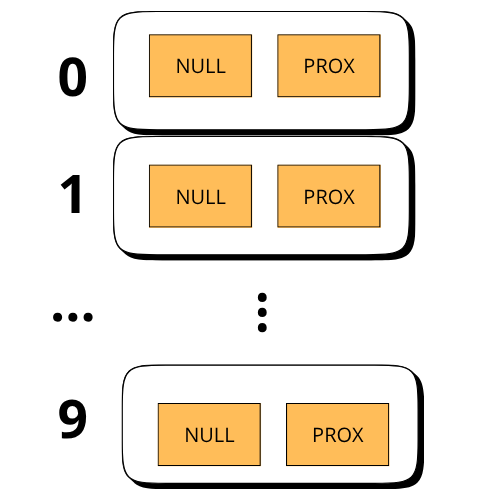

# AEDI - Trabalha Prático II
## Ennoile Raquel e Heloíse Vitória
## Porque Utilizei a função hash?

Nos foi disponibilizado um trabalho a ser desenvolvido de forma prática: 

onde foi definido que utilizariamos a tabela hash. Portanto neste trabalho, foi utilizada uma função hash simples, baseada na operação de módulo para calcular o índice onde cada aluno será inserido na tabela.

A função hash utilizada é:

### E como funciona?
A função recebe como entrada a matrícula do aluno tendo como regra ser um número inteiro. 
Ela calcula o resto da divisão da matrícula pelo valor fixado para o tamanho da tabela. O resultado é um número entre 0 e TAMANHO_TABELA - 1, que indica em qual bucket (lista encadeada) o aluno deve ser armazenado.

Exemplo prático com TAMANHO_TABELA = 10

| Matrícula | Cálculo matricula % 10 | Bucket (índice) |
| --------- | ------------------------ | --------------- |
| 123       | 123 % 10 = 3             | 3               |
| 45        | 45 % 10 = 5              | 5               |
| 77        | 77 % 10 = 7              | 7               |
| 13        | 13 % 10 = 3              | 3 (colisão)     |

Percebe - se que as matrículas 123 e 13 caem no mesmo bucket (índice 3), provocando uma colisão, que será resolvida com encadeamento (lista ligada com célula cabeça).
A escolha dessa função se baseia na sua simplicidade e eficiência computacional: Rápida de calcular.

## A análise dos buckets após cada inserção
Cada vez que um aluno é inserido no sistema, a função hash define em qual bucket (lista encadeada) da tabela o aluno será armazenado. Dependendo da matrícula, o aluno pode ser inserido em um bucket vazio onde não ocorre colisão, ou em um bucket já ocupado que ocorrerá a colisão, e será adicionado ao final da lista encadeada daquele bucket. Neste trabalho, a resolução de colisões é feita através de encadeamento com célula cabeça.

### Exemplo

Temos uma tabela que contém 10 buckets (índices 0 a 9), todos iniciados com apenas a célula cabeça:

Exemplo de inserções
abaixo, e análise após cada inserção de aluno:

1. Inserir aluno com matrícula 23: índice = 23 % 10 = 3

2. Inserir aluno com matrícula 34: índice = 34 % 10 = 4

3. Inserir aluno com matrícula 13: índice = 13 % 10 = 3.
O bucket 3 já contém 23. O novo aluno será encadeado ao final:

4. Inserir aluno com matrícula 45: índice = 45 % 10 = 5

5. Inserir aluno com matrícula 3: índice = 3 % 10 = 3. 
O bucket 3 já contém 23 e 13. Agora:
 

 Após essas inserções, temos:

Bucket 3 com 3 alunos → colisões resolvidas com encadeamento.

Buckets 4 e 5 com 1 aluno cada → sem colisão.
Os demais buckets permanecem vazios (apenas com a célula cabeça)

 

 ## Vizualizando
Inserindo um aluno!
  

Buscando Aluno com a matricula 123!
 

Exibindo alunos matriculados!
 

Mostrando a estatistica!

Removendo aluno!

Mostrando exemplo com colisão!

Estatistica com colisão!

